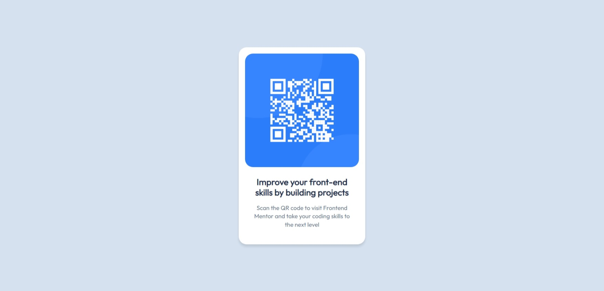

# Frontend Mentor - QR code component solution

This is a solution to the [QR code component challenge on Frontend Mentor](https://www.frontendmentor.io/challenges/qr-code-component-iux_sIO_H). Frontend Mentor challenges help you improve your coding skills by building realistic projects. 

## Table of contents

- [Overview](#overview)
  - [Screenshot](#screenshot)
- [My process](#my-process)
- [Author](#author)

## Overview

### Screenshot

## My process

### Built with

- Semantic HTML5 markup
- CSS custom theme color
- CSS import [outfit font family](https://fonts.google.com/share?selection.family=Outfit) from google font
- CSS custom font properties
- Flexbox layout
- justify-content / align-items
- Border raduis
- Customize margin and padding

## Author

- Frontend Mentor - [@phurin-git](https://www.frontendmentor.io/profile/phurin-git)